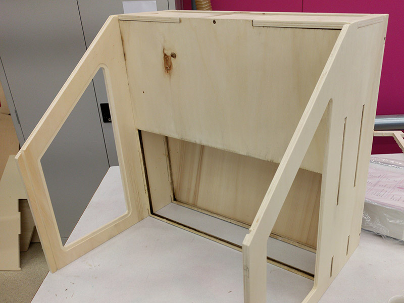
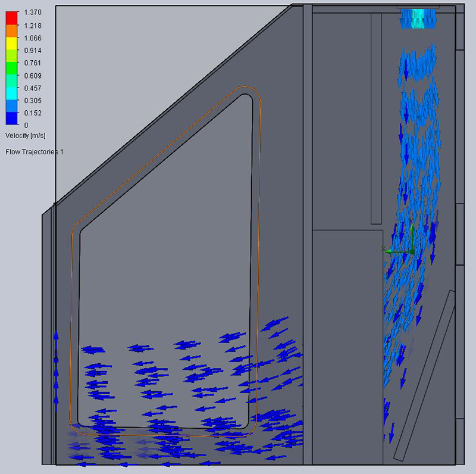

We're making a DIY [laminar flow hood](https://en.wikipedia.org/wiki/Laminar_flow_cabinet).  
It will help to create a more sterile environment for use with our [DIY biolab](https://fablabwgtn.github.io/DIY-biolab/).

The open laminar flow hood is still in active development, if you're interested in making one [get in touch](https://fablabwgtn.co.nz/contact/) for the latest version.  

  

  
